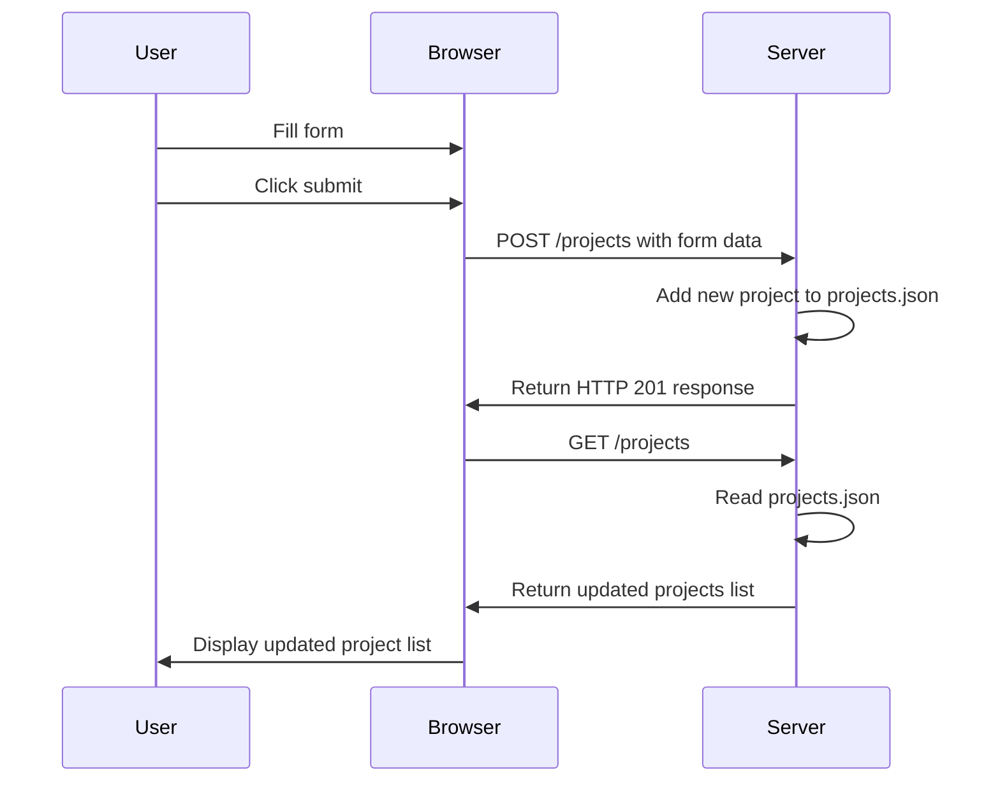

```mermaid
sequenceDiagram
    participant User
    participant Browser
    participant Server

    User->>Browser: Fill form
    User->>Browser: Click submit
    Browser->>Server: POST /projects with form data
    Server ->> Server: Add new project to projects.json
    Server ->> Browser: Return HTTP 201 response
    Browser ->> Server: GET /projects
    Server ->> Server: Read projects.json
    Server ->> Browser: Return updated projects list
    Browser ->> User: Display updated project list
```